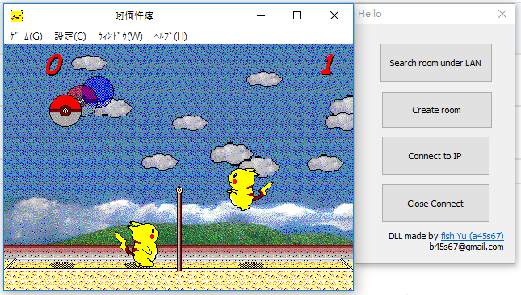

Pikachu Volleyball P2P (.exe version)
=======================

## How to use
1. Download "Pikachu-Volleyball-P2P.zip" and unzip it.
2. Excute "new_pika_IAT_mod.exe" and select 2P mode.
3. Set the ip and port 
4. Play

> ### Note  
> + I download the .exe of this game from internet, and modify it to "new_pika_IAT_mod.exe".   
I did not trace throughly of this binary, not sure if this file is safe =口=...   
( At least built-in Windows Defence didn't warn me )
> + "connect.dll" is the compiled output of project "connect" in "connect/" with Visual Studio.  
This is writen by myself, I think it is safe(?)

## Change Log
- 2020/6/26
  - Add the Create room and Search room buttom
  - Add Close room/connection buttom to handle unexpected connection

## Description of some important source files
- **binary modification/inject PE/insert.c** : 
  - change the characteristics of .rsrc section to RWX and expand it for new func, new IAT.  
  (At first I considered to add a new section for functions, append new DLL exports to import table directly with PE Lord. But it said there was no space. :cry: )
  - insert func shellcode, expand IAT for DLL injection
  - change the flow of code
  
- **binary modification/func shellcode/func_gen.py**
  - generate the functions to do something after hook
  
- **connect/connect.slm**
  - generate the connect.dll responsible for socket intialization, communication between users.
  
## Tools

- Dynamic reverse engineering
  - x32dbg
  - Cheat Engine
- Static disassembly
  - IDA pro 7.0 
  - Ghidra
- PE related
  - PE Lord
  - PE bear
  
- Shellcode
  - pwntools

## Future work

Haven't decided, maybe better user experience.

## References

- 加密與解密 第四版 
  - Chap.11 PE文件格式 
  - Chap.12 注入技術
  - Chap.22 補丁技術
  - chap.23 代碼的二次開發
- [gorisanson/pikachu-volleyball](https://github.com/gorisanson/pikachu-volleyball)

- [Getting Started with Winsock](https://docs.microsoft.com/en-us/windows/win32/winsock/getting-started-with-winsock)

- [Using Dialog Boxes](https://docs.microsoft.com/en-us/windows/win32/dlgbox/using-dialog-boxes)

- [Getting Started Reversing C++ Objects with Ghidra](https://www.youtube.com/watch?v=ir2B1trR0fE)

- [Using Mutex Objects](https://docs.microsoft.com/en-us/windows/win32/sync/using-mutex-objects)

- [Windows Socket 速查筆記](http://www.cchsu.com/arthur/prg_bg5/winsock.htm) Non-blocking socket 的相關操作

- [Beej's Guide to Network Programming 正體中文版 - 7.2. select()：同步 I/O 多工](http://beej-zhtw.netdpi.net/07-advanced-technology/7-2-select)

## Solutions of problems I encounted when programming

- [VCRUNTIME140.dll is missing](https://stackoverflow.com/questions/35805113/visual-studio-2015-run-time-dependencies-or-how-to-get-rid-of-universal-crt)

- [TCP/UDP埠列表](https://zh.wikipedia.org/wiki/TCP/UDP%E7%AB%AF%E5%8F%A3%E5%88%97%E8%A1%A8)

- [How do you use CreateThread for functions which are class members?](https://stackoverflow.com/questions/1372967/how-do-you-use-createthread-for-functions-which-are-class-members)

- [My TCP servr was killed with WSACancelBlockingCall?](https://stackoverflow.com/questions/23156693/my-tcp-servr-was-killed-with-wsacancelblockingcall) : 當我建立房間時，如果`create_room_socket()`接收到多次來自其他人`search_room_socket()`的connect要求，另一個thread中`create_socket()`的`accept()`會直接跳出並得到`10004`的error code，發現似乎是由於我每次回應後都會call `WSACleanup()`導致WinSock2.0被關閉。註解掉後暫時沒問題。

- [SetFocus() in WM_INITDIALOG](http://forums.codeguru.com/showthread.php?432495-SetFocus()-in-WM_INITDIALOG) : I want to set the editbox bind to the keybord input in default. But almost every disscussion thread I found with Google say that just using `SetFocus()` when accept `WM_INITDIALOG` msg. And it seems not work to me. Finally I found that it must return `false` when accepting `WM_INITDIALOG` or the Dialog will still apply the default keyboard focus. For more details, refer to [WM_INITDIALOG message](https://docs.microsoft.com/zh-tw/windows/win32/dlgbox/wm-initdialog?redirectedfrom=MSDN).

- [adding syslink not displaying mfc dialog box](https://stackoverflow.com/questions/25397814/adding-syslink-not-displaying-mfc-dialog-box) / [C++: Dialogs with SysLink control do not show up](https://twigstechtips.blogspot.com/2010/03/c-dialogs-with-syslink-control-do-not.html) 總結是syslink不支援dialog使用的unicode編碼導致...加入以下code可以解決

    #pragma comment(linker,"\"/manifestdependency:type='win32'\name='Microsoft.Windows.Common-Controls' version='6.0.0.0' \processorArchitecture='*' publicKeyToken='6595b64144ccf1df' language='*'\"")
